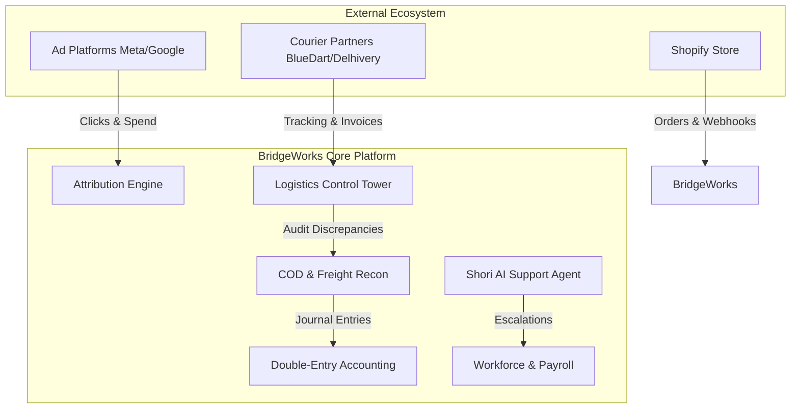
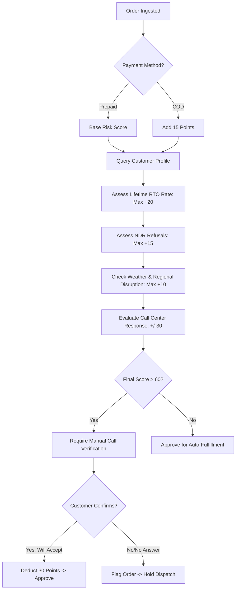
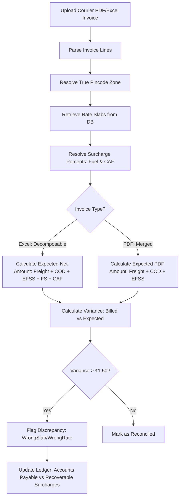
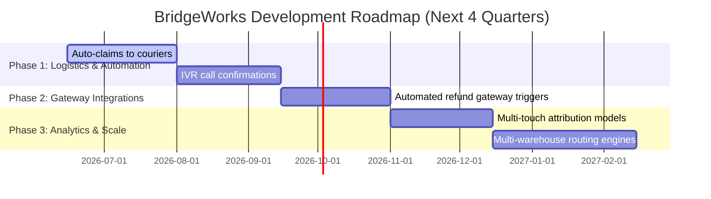

# BridgeWorks (Shori) ERP/CRM Operations Platform
## Structured Investor-Grade Product Research & Module Assessment Report

> [!NOTE]  
> This document serves as an independent technical and operational due diligence assessment of the BridgeWorks (Shori) E-Commerce Operating System. It has been prepared for executive management and potential investors to evaluate product maturity, technical architecture, competitive differentiation, and operational defensibility.

---

## 1. Executive Summary

BridgeWorks (also referred to as Shori) is a comprehensive, multi-tenant e-commerce operating system designed to bridgeworks operations, logistics, marketing attribution, accounting, customer care, and HR into a single cohesive platform. 

Shopify merchants typically manage operations using a fragmented tool stack: separate apps for order fulfillment, shipment tracking (e.g., Shipway, ShipStation), ad attribution (e.g., Triple Whale), double-entry bookkeeping (e.g., Zoho Books, QuickBooks), customer support (e.g., Chatwoot, Gorgias), and workforce coordination (e.g., Slack, BambooHR). BridgeWorks's core value proposition is the elimination of this software fragmentation by providing a unified data model. 

### Key Findings:
* **Product Maturity:** The core system is operationally viable, transitioning from MVP to Enterprise-grade. The **Logistics Control Tower** stands at ~85% enterprise readiness, backed by an advanced **Freight Billing Reconciliation Engine** and an **8-Signal RTO (Return-to-Origin) Predictive Model**.
* **High-Leverage Workflows:** BridgeWorks drives operational efficiency through automated order verification, first-party marketing attribution, and automated freight auditing. These features directly address margin leakage, which is critical for direct-to-consumer (D2C) brands in emerging markets.
* **AI Integration:** The platform integrates Google Gemini AI. Features include the **Shori Support Agent** (utilizing Gemini context caching to lower API overhead) and **AURA AI Agents** for localized decision support in logistics and marketing.
* **Architecture Highlights:** Built on Python 3.12/Django 5.2/React 19, BridgeWorks features an ASGI server (Daphne) for WebSocket connections, Redis for caching and presence, and Django-Q2 for background tasks. It includes PgBouncer for database connection pooling.

---

## 2. Product Vision

BridgeWorks's product vision is to establish a unified "E-Commerce Operating System" that acts as the single source of truth for a brand's operations.



### Strategic Value:
* **Consolidated Data Schema:** Connecting a customer's click journey directly to their order, delivery attempts, support interactions, and financial ledger items removes data silos. This enables real-time calculations of true Customer Acquisition Cost (CAC) and customer-level Net Profitability.
* **Efficiency Gains:** Automating manual tasks—such as reconciling COD courier remittance PDFs and analyzing shipping weights—helps brands scale order volume without a proportional increase in operations staff.
* **System of Record:** By housing double-entry ledger accounts alongside HR payroll, workforce logs, and candidate pipelines, BridgeWorks creates high switching costs, driving long-term customer retention.

---

## 3. Module-by-Module Analysis

### Module 1: Operations & Fulfillment
* **Purpose:** Daily order processing, verification, batch printing, and packaging validation.
* **Target User/Persona:** Operations Manager, Warehouse Packers, Customer Calling Agents.
* **Functional Workflows:** Webhook-based Shopify order ingestion, Calling Sheet for manual/automatic order confirmation, AWB generation, and Packaging checklists with weight verification.
* **Workflow Maturity:** **Production-Ready.** Supports high-concurrency background batching.
* **Automation Depth:** Highly automated order ingestion and batch grouping.
* **AI Usage Opportunities:** AI-driven automated phone call transcripts and auto-confirmation overrides.
* **Data Flow Architecture:** Shopify Webhook $\rightarrow$ Webhook Ingestion $\rightarrow$ Risk Evaluation Worker $\rightarrow$ Calling Sheet / Auto-confirm.
* **Operational Dependencies:** Shopify API, printed label batches.
* **Integration Ecosystem:** Shopify REST/GraphQL API.
* **Scalability Potential:** High. Grouping orders into printed batches scales fulfillment operations efficiently.
* **Multi-Team Usage:** Shared sheet views with role-based columns.
* **Operational Bottlenecks Solved:** Eliminates manual search-and-print operations for individual orders.
* **Existing Limitations:** No direct support for wave or zone picking strategies.
* **Competitive Differentiation:** Integrates customer risk metrics directly into the order list view.
* **Roadmap Opportunities:** Barcode packing station UI and automatic picklist generation.

### Module 2: Logistics & Shipment Management
* **Purpose:** Multi-courier tracking, last-mile monitoring, anomaly detection, and SLA breach management.
* **Target User/Persona:** Logistics Operations Head, Customer Support Team.
* **Functional Workflows:** Live tracking ingestion, 5-signal composite courier health scorecard, geographic delay heatmaps, and automated SLA breach penalty claims.
* **Workflow Maturity:** **Enterprise-Grade.** The Control Tower is highly functional.
* **Automation Depth:** Direct pull of courier tracking scans and automatic discrepancy generation.
* **AI Usage Opportunities:** Machine-learning models to predict delay times based on hub congestion.
* **Data Flow Architecture:** Webhook/API $\rightarrow$ Tracking Event Engine $\rightarrow$ Shipment Costs $\rightarrow$ Ledger Reconciliation.
* **Operational Dependencies:** Courier tracking APIs.
* **Integration Ecosystem:** Shipway, BlueDart, Delhivery, Sagepilot.
* **Scalability Potential:** High, using optimized database indexes for tracking states.
* **Multi-Team Usage:** Shared views between Logistics Operations and Finance.
* **Operational Bottlenecks Solved:** Eliminates the need to log into multiple courier dashboards (e.g., Delhivery, BlueDart) to track delayed packages.
* **Existing Limitations:** Depends on third-party middleware APIs for some courier connections.
* **Competitive Differentiation:** Quantifies SLA violations in monetary terms based on active contracts.
* **Roadmap Opportunities:** Automated courier reallocation based on composite score trends.

### Module 3: Reverse Shipment & Intelligence
* **Purpose:** Predicting and mitigating Return-to-Origin (RTO) risk.
* **Target User/Persona:** Calling Agents, Customer Retention Team.
* **Functional Workflows:** Automated risk profiling on incoming orders using customer purchase history, payment method, address patterns, and weather disruptions.
* **Workflow Maturity:** **Production-Ready.**
* **Automation Depth:** Real-time scoring of incoming orders before fulfillment.
* **AI Usage Opportunities:** Predictive model triggers actions (e.g., hold dispatch, request prepayment).
* **Data Flow Architecture:** Order Ingestion $\rightarrow$ Risk Engine $\rightarrow$ Customer Risk Profile $\rightarrow$ Order Status Flag.
* **Operational Dependencies:** Historical customer order database.
* **Integration Ecosystem:** Internal models and external weather alerts.
* **Scalability Potential:** High, with background execution of scoring jobs.
* **Multi-Team Usage:** High. Shared views for calling agents and dispatch managers.
* **Operational Bottlenecks Solved:** Reduces return shipping costs by preventing delivery failures on high-risk COD orders.
* **Existing Limitations:** Risk scores are dependent on having sufficient historical data for a phone number.
* **Competitive Differentiation:** Provides D2C brands with predictive RTO mitigation tools.
* **Roadmap Opportunities:** Machine learning models for address correction.

### Module 4: Returns & Exchange Engine
* **Purpose:** Managing customer returns, exchange shipping, quality checks, and refund workflows.
* **Target User/Persona:** Quality Control Inspector, Support Representative.
* **Functional Workflows:** Return case logging, reverse pickup AWB generation, warehouse QA status updates, and refund queue management.
* **Workflow Maturity:** **Partially Implemented.**
* **Automation Depth:** Generates reverse logistics tracking records.
* **AI Usage Opportunities:** Visual QA checks using product images.
* **Data Flow Architecture:** Return Request $\rightarrow$ QC Validation $\rightarrow$ Refund Status $\rightarrow$ Ledger Entries.
* **Operational Dependencies:** Warehouse inspection team.
* **Integration Ecosystem:** Shopify Fulfillments, Shipping partners.
* **Scalability Potential:** Moderate, due to manual QA steps.
* **Multi-Team Usage:** Customer support logbook, warehouse receiving logs, and finance checks.
* **Operational Bottlenecks Solved:** Prevents refund leakage by verifying returned items before issuing credit.
* **Existing Limitations:** Refunds are calculated but must be triggered manually in payment gateways.
* **Competitive Differentiation:** Directly connects return workflows to the double-entry accounting ledger.
* **Roadmap Opportunities:** Integrations with payment gateways (e.g., Razorpay) to automate refunds.

### Module 5: Marketing & Growth
* **Purpose:** First-party visitor tracking, UTM parameters mapping, and marketing campaign attribution.
* **Target User/Persona:** Growth Marketer, CMO.
* **Functional Workflows:** Click tracking (`bridgeworks-pixel.js`), Facebook and Google click ID mapping, campaign spend sync, and ad-level ROAS backfill tasks.
* **Workflow Maturity:** **Production-Ready.** Matches dedicated attribution SaaS platforms.
* **Automation Depth:** Automatic daily sync and ad-to-order mapping.
* **AI Usage Opportunities:** Budget recommendations based on campaign ROAS.
* **Data Flow Architecture:** Pixel Click Log $\rightarrow$ Order Ingestion $\rightarrow$ Attribution Matching Task $\rightarrow$ ROAS Summary.
* **Operational Dependencies:** Graph APIs for Meta and Google Ads.
* **Integration Ecosystem:** Meta Ads, Google Ads Graph APIs.
* **Scalability Potential:** High, using asynchronous backfill tasks.
* **Multi-Team Usage:** Marketing and Finance departments.
* **Operational Bottlenecks Solved:** Resolves attribution discrepancies caused by cookie blocking.
* **Existing Limitations:** Relies on manual credential configuration for ad platforms.
* **Competitive Differentiation:** Calculates ROAS based on actual delivered orders rather than raw conversion pixels.
* **Roadmap Opportunities:** Support for linear, time-decay, and position-based attribution models.

### Module 6: Sales & Business Development
* **Purpose:** Managing wholesale leads, B2B quotes, draft orders, and retail analytics.
* **Target User/Persona:** B2B Sales Manager, Retail Head.
* **Functional Workflows:** Wholesale customer CRM, draft order creation, and B2B pricing catalogs.
* **Workflow Maturity:** **MVP Stage.** Less mature than the core D2C logistics modules.
* **Automation Depth:** Manual entry of B2B quotes and draft orders.
* **AI Usage Opportunities:** AI-generated wholesale deal recommendations.
* **Data Flow Architecture:** Lead $\rightarrow$ B2B Quotation $\rightarrow$ Draft Order $\rightarrow$ Shopify Invoice.
* **Operational Dependencies:** Shopify draft order API.
* **Integration Ecosystem:** Shopify Admin API.
* **Scalability Potential:** Moderate.
* **Multi-Team Usage:** Sales reps and inventory managers.
* **Operational Bottlenecks Solved:** Simplifies wholesale quotation tracking.
* **Existing Limitations:** Basic feature set compared to dedicated wholesale platforms.
* **Competitive Differentiation:** Integrates B2B deals directly into the unified financial dashboard.
* **Roadmap Opportunities:** Customer portals for direct wholesale ordering.

### Module 7: Finance & Accounting
* **Purpose:** Multi-tenant double-entry accounting, ledger tracking, banking reconciliation, and financial reporting.
* **Target User/Persona:** CFO, Accountant.
* **Functional Workflows:** Journal entries, Chart of Accounts, Trial Balance, dynamic Profit & Loss, Balance Sheet generation, and bank CSV statement parsing.
* **Workflow Maturity:** **Production-Ready.** Highly structured ledger matching.
* **Automation Depth:** Automated transaction creation from invoices and payroll.
* **AI Usage Opportunities:** Automated invoice scanning and parsing using Gemini Vision.
* **Data Flow Architecture:** Journal Entry $\rightarrow$ Ledger Accounts $\rightarrow$ Financial Statements (Trial Balance, P&L, Balance Sheet).
* **Operational Dependencies:** Bank statement exports, verified expense logs.
* **Integration Ecosystem:** Local bank CSV uploads.
* **Scalability Potential:** High, with database-level ledger aggregation.
* **Multi-Team Usage:** Finance and executive management.
* **Operational Bottlenecks Solved:** Eliminates manual data entry between operations and accounting software.
* **Existing Limitations:** No direct API sync with bank feeds.
* **Competitive Differentiation:** Native connection to shipping, inventory, and payroll data.
* **Roadmap Opportunities:** Open banking API integrations.

### Module 8: My Desk — Personal Workspace
* **Purpose:** Employee productivity, task tracking, notes, daily work journals, and attendance.
* **Target User/Persona:** All organization staff members.
* **Functional Workflows:** Kanban task boards, rich-text note taking, daily logbook entries, and leave/expense requests.
* **Workflow Maturity:** **Production-Ready.** Backed by a comprehensive view service file.
* **Automation Depth:** Generates calendar links for scheduled meetings.
* **AI Usage Opportunities:** Daily productivity digests.
* **Data Flow Architecture:** User Input $\rightarrow$ My Desk DB $\rightarrow$ HR Logs.
* **Operational Dependencies:** Workspace configuration.
* **Integration Ecosystem:** Google Calendar, Google Meet.
* **Scalability Potential:** High, with paginated task sheets.
* **Multi-Team Usage:** Individual workspaces linked to organization-wide task boards.
* **Operational Bottlenecks Solved:** Eliminates scattered notes and manual attendance tracking.
* **Existing Limitations:** No offline support for task editing.
* **Competitive Differentiation:** Combines productivity tools with HR compliance metrics.
* **Roadmap Opportunities:** Mobile app for easier check-ins.

### Module 9: Team Chat & Real-Time Communication
* **Purpose:** Internal organizational communication.
* **Target User/Persona:** All employees.
* **Functional Workflows:** Direct messages, group channels, online presence tracking, and document sharing.
* **Workflow Maturity:** **Production-Ready.** Built on Django Channels using WebSockets.
* **Automation Depth:** Real-time presence detection and read receipts.
* **AI Usage Opportunities:** Chat summaries and automated task reminders.
* **Data Flow Architecture:** Client Msg $\rightarrow$ Django Channels Consumer $\rightarrow$ Redis Layer $\rightarrow$ Client.
* **Operational Dependencies:** Redis service.
* **Integration Ecosystem:** Google Calendar scheduling in chat.
* **Scalability Potential:** High, supported by Daphne.
* **Multi-Team Usage:** Cross-department communication channels.
* **Operational Bottlenecks Solved:** Eliminates the need for external chat platforms.
* **Existing Limitations:** Chat data is stored locally without external backup integrations.
* **Competitive Differentiation:** Integrates business context (e.g., sharing order cards) directly into chat.
* **Roadmap Opportunities:** Advanced message threading and search.

### Module 10: Customer Care & AI Support Agent
* **Purpose:** Omnichannel support ticket management and AI-powered automated replies.
* **Target User/Persona:** Support Team Lead, Customer Experience Manager.
* **Functional Workflows:** SSO integration with Chatwoot, automated website scraping for knowledge extraction, whitelisted testing sandboxes, and automated human handover rules.
* **Workflow Maturity:** **Enterprise-Grade.** Features advanced prompt management.
* **Automation Depth:** Generates draft responses and automatically routes complex tickets to agents.
* **AI Usage Opportunities:** Gemini context caching to lower API overhead on large storefront knowledge bases.
* **Data Flow Architecture:** Chatwoot Webhook $\rightarrow$ Shori Engine $\rightarrow$ Knowledge Nuggets $\rightarrow$ Gemini Response $\rightarrow$ Chatwoot API.
* **Operational Dependencies:** Gemini API credentials.
* **Integration Ecosystem:** Chatwoot.
* **Scalability Potential:** High, using cached prompt contexts.
* **Multi-Team Usage:** Shared agent sandboxes and handovers.
* **Operational Bottlenecks Solved:** Reduces customer support workloads for common queries.
* **Existing Limitations:** Scraping is browser-based, which can be fragile when page layouts change.
* **Competitive Differentiation:** Dynamic SOP overrides and Gemini context caching.
* **Roadmap Opportunities:** WhatsApp API integrations.

### Module 11: Human Resources & Team Management
* **Purpose:** Employee records, org charts, compensation tracking, and payroll runs.
* **Target User/Persona:** HR Manager, CFO.
* **Functional Workflows:** Employee master records, org tree visualizations, salary slip generation, and attendance monitoring.
* **Workflow Maturity:** **Production-Ready.**
* **Automation Depth:** Generates payroll sheets based on attendance logs.
* **AI Usage Opportunities:** Skill mapping and attrition prediction.
* **Data Flow Architecture:** Time Logs $\rightarrow$ Workforce DB $\rightarrow$ Payroll Calculator $\rightarrow$ Ledger.
* **Operational Dependencies:** Employee profile bank details.
* **Integration Ecosystem:** Internal payroll accounting.
* **Scalability Potential:** High.
* **Multi-Team Usage:** HR admins and company managers.
* **Operational Bottlenecks Solved:** Replaces spreadsheet-based HR administration.
* **Existing Limitations:** Lacks direct integrations with tax compliance platforms.
* **Competitive Differentiation:** Native connection to internal accounting ledgers.
* **Roadmap Opportunities:** Direct bank integration for salary payouts.

### Module 12: Hiring & ATS
* **Purpose:** Job postings and recruitment pipelines.
* **Target User/Persona:** Recruiting Team.
* **Functional Workflows:** Job board manager, Kanban candidate tracker, interview scheduler, and offer letter generation.
* **Workflow Maturity:** **Production-Ready.**
* **Automation Depth:** Pipeline stages update status automatically based on scheduler.
* **AI Usage Opportunities:** AI-driven resume parsing and candidate matching.
* **Data Flow Architecture:** Application $\rightarrow$ Pipeline Stages $\rightarrow$ Schedule $\rightarrow$ Offer $\rightarrow$ Employee Profile.
* **Operational Dependencies:** Google Calendar API.
* **Integration Ecosystem:** Candidate profile files.
* **Scalability Potential:** High, with paginated pipelines.
* **Multi-Team Usage:** Hiring managers and interviewers.
* **Operational Bottlenecks Solved:** Consolidates recruitment communications.
* **Existing Limitations:** No direct integration with external job boards.
* **Competitive Differentiation:** Seamless conversion of candidates to employee records on offer acceptance.
* **Roadmap Opportunities:** Integrations with job boards (e.g., LinkedIn).

### Module 13: Product & Merchandising
* **Purpose:** Inventory levels, SKU tracking, and warehouse stocking logs.
* **Target User/Persona:** Inventory Manager, Merchandiser.
* **Functional Workflows:** Live SKU stock lists, stock ledger movement history, and AI demand forecasting.
* **Workflow Maturity:** **Production-Ready.**
* **Automation Depth:** Syncs Shopify product caches using webhook signals.
* **AI Usage Opportunities:** Dynamic restocking recommendations.
* **Data Flow Architecture:** Shopify Inventory $\rightarrow$ Webhook/Sync $\rightarrow$ Cache $\rightarrow$ Forecast Engine.
* **Operational Dependencies:** Shopify product cache accuracy.
* **Integration Ecosystem:** Shopify GraphQL API.
* **Scalability Potential:** High, supported by cached database records.
* **Multi-Team Usage:** Warehouse staff and finance team.
* **Operational Bottlenecks Solved:** Prevents inventory out-of-stock events on high-velocity items.
* **Existing Limitations:** Lacks multi-warehouse routing rules.
* **Competitive Differentiation:** Connects SKU performance directly to growth ad spend.
* **Roadmap Opportunities:** Multi-warehouse routing logic.

### Module 14: Intelligence & AI Engines
* **Purpose:** Background anomaly detection and natural language processing.
* **Target User/Persona:** Operations Head, Executive Team.
* **Functional Workflows:** Real-time weather alerts sync, courier NDR remarks parsing, and transaction anomaly watchdogs.
* **Workflow Maturity:** **Production-Ready.**
* **Automation Depth:** Background evaluation tasks parse data hourly.
* **AI Usage Opportunities:** Gemini API parses natural language status updates.
* **Data Flow Architecture:** System Logs $\rightarrow$ Anomaly Watchdog $\rightarrow$ System Warning flags.
* **Operational Dependencies:** Gemini API credentials.
* **Integration Ecosystem:** External weather APIs.
* **Scalability Potential:** High, run as background tasks.
* **Multi-Team Usage:** Operations and finance managers.
* **Operational Bottlenecks Solved:** Surfaces operational risks automatically.
* **Existing Limitations:** High API call volume can lead to rate limits.
* **Competitive Differentiation:** Integrates operational context directly into AI actions.
* **Roadmap Opportunities:** Custom predictive modeling tools.

---

## 4. Workflow Breakdown

### A. RTO Risk Scoring Engine
The system uses an 8-signal scoring model to assess RTO (Return-to-Origin) risk before dispatch, helping prevent logistics losses on COD orders.



#### Code Implementation (From `customer_risk_service.py`):
```python
def compute_ndr_rto_score(order) -> int:
    score = 0
    profile = CustomerRiskProfile.objects.filter(
        org_id=order.org_id, customer_phone=order.contact_phone
    ).first()

    # 1. Lifetime RTO Rate (Max 20 points)
    if profile and profile.total_orders > 0:
        rto_val = float(profile.rto_count) / profile.total_orders
        if rto_val > 0.5: score += 20
        elif rto_val > 0.3: score += 15

    # 2. Payment Method (Max 15 points)
    if 'cod' in (order.financial_status or '').lower():
        score += 15

    # 3. Weather Disruption (Max 10 points)
    if order.shipping_state:
        alert = WeatherAlert.objects.filter(state_name__iexact=order.shipping_state.strip(), is_active=True).first()
        if alert: score += 10

    # 4. Customer Responsiveness Adjustment (Max +/- 30 points)
    call_status = (order.ndr_call_status or '').lower()
    if call_status == 'will accept':
        score -= 30
    elif call_status in ('refused', 'cancelled'):
        score += 30

    return max(0, min(int(score), 100))
```

* **Business Outcome:** Identifies high-risk COD orders, prompting automated confirmation calls and reducing RTO rates.

---

### B. Freight Billing Reconciliation Engine
BridgeWorks reconciles courier invoices to identify shipping overcharges, checking rates against zones, weight slabs, and surcharges.



#### Code Implementation (From `discrepancy_engine.py`):
```python
def analyse_line(self, line, rate_card=None, slabs=None) -> None:
    # 1. Resolve shipping zone based on origin & destination pincodes
    zone = self._resolve_zone(line, rate_card)
    
    # 2. Retrieve Fuel Surcharge (FS) and Currency Adjustment Factor (CAF) rates
    fs_percent, caf_percent = self._resolve_surcharge_percents(
        rate_card, line.freight_invoice.invoice_date
    )

    # 3. Calculate expected breakdown using matching courier strategy
    breakdown = self.strategy.compute_full_breakdown(
        zone=zone, weight_kg=Decimal('0.5'),
        is_cod=self._is_cod_shipment(line),
        rate_card=rate_card, slabs=slabs,
        fs_percent=fs_percent, caf_percent=caf_percent
    )

    if breakdown:
        line.expected_total = breakdown.net_amount if line.billing_layer == 'excel' else breakdown.pdf_amount
        line.overcharge_amount = max(line.total_billed - line.expected_total, Decimal('0'))
        
        # 4. Classify discrepancy type
        if line.overcharge_amount > Decimal('1.50'):
            line.discrepancy_type = 'WrongRate'
```

* **Business Outcome:** Automates shipping invoice audits to identify overbilling, enabling brands to claim refunds from logistics partners.

---

### C. Shori Support Agent (Gemini Caching)
The AI support agent uses Gemini context caching to store store policies, FAQ databases, and product catalogs, reducing prompt compilation latency and API token costs.

```mermaid
sequenceDiagram
    participant Customer
    participant Chatwoot
    participant ShoriService
    participant GeminiCache
    participant GeminiAPI

    Customer->>Chatwoot: Sends message (e.g., "Where is order #41202?")
    Chatwoot->>ShoriService: Webhook Event
    ShoriService->>ShoriService: Query Order & Shipment Context
    
    rect rgb(30, 41, 59)
        Note over ShoriService, GeminiCache: Context Caching Lifecycle (1-Hour TTL)
        ShoriService->>GeminiCache: Check active cache ID
        alt Cache Expired or Invalid
            ShoriService->>ShoriService: Compile Knowledge Base Nuggets
            ShoriService->>GeminiCache: Write Context Cache (Model: gemini-2.0-flash)
            GeminiCache-->>ShoriService: Return Cache ID
        else Cache Valid
            GeminiCache-->>ShoriService: Return Cache ID
        end
    end

    ShoriService->>GeminiAPI: Send user prompt (referenced to Cache ID)
    GeminiAPI-->>ShoriService: Stream token chunks (Priority, Labels, Reply)
    ShoriService-->>Chatwoot: Deliver message back to chat channel
    Chatwoot-->>Customer: Render message response
```



#### Code Implementation (From `ai_support_agent.py`):
```python
def get_or_create_gemini_cache(client, agent: AIAgent, force_refresh=False) -> str:
    if agent.gemini_cache_id and not force_refresh:
        try:
            cache = client.caches.get(name=agent.gemini_cache_id)
            return agent.gemini_cache_id
        except Exception:
            agent.gemini_cache_id = None

    full_context = compile_agent_context(agent)
    cache = client.caches.create(
        model='gemini-2.0-flash',
        config=types.CreateCachedContentConfig(
            contents=[full_context],
            ttl='3600s',  # Cached for 1 hour
            display_name=f"bridgeworks_agent_cache_{agent.id}",
        )
    )
    agent.gemini_cache_id = cache.name
    agent.save(update_fields=['gemini_cache_id'])
    return cache.name
```

* **Business Outcome:** Lower operational costs for AI-driven customer care, combined with automated handovers for complex inquiries (such as damage claims).

---

### D. Multi-Platform Attribution Engine
First-party tracking records visitor click journeys (`touch_journey`) and attributes downstream sales to Meta or Google ad campaigns via an asynchronous matching task.

```mermaid
sequenceDiagram
    participant Visitor
    participant PixelJS
    participant ShopifyStore
    participant BridgeWorksDB
    participant DRF_BackfillTask

    Visitor->>ShopifyStore: Click Ad Link (Meta: fbclid / Google: gclid)
    PixelJS->>PixelJS: Parse click parameters from URL
    PixelJS->>BridgeWorksDB: Log click event to Pixel database
    Visitor->>ShopifyStore: Completes purchase
    ShopifyStore-->>BridgeWorksDB: Ingest order via webhook (unattributed)
    
    rect rgb(30, 41, 59)
        Note over DRF_BackfillTask, BridgeWorksDB: Async Background Reconcile (Q2 worker)
        DRF_BackfillTask->>BridgeWorksDB: Fetch unattributed orders
        DRF_BackfillTask->>BridgeWorksDB: Match order contact info with logged pixel sessions
        DRF_BackfillTask->>BridgeWorksDB: Build Touch Journey (First-touch vs Multi-touch)
        DRF_BackfillTask->>BridgeWorksDB: Map Click ID (fbclid/gclid) to ad platform campaign IDs
        DRF_BackfillTask->>BridgeWorksDB: Write OrderAttribution records (ROAS, CPA)
    end
```



#### Code Implementation (From `views_attribution.py`):
```python
# Process touch journeys for attribution
for attr in q_attr_curr.select_related('order'):
    journey = attr.touch_journey or []
    price = Decimal(str(attr.order.total_price or 0))
    
    if len(journey) <= 1:
        first_visit_count += 1
        first_visit_revenue += price
    else:
        multi_visit_count += 1
        multi_visit_revenue += price
    
    # Generate multi-touch attribution pathway
    path = " → ".join(get_channel_label(step.get('source')) for step in journey)
    if path not in path_counts:
        path_counts[path] = {'count': 0, 'revenue': Decimal('0.00')}
    path_counts[path]['count'] += 1
    path_counts[path]['revenue'] += price
```

* **Business Outcome:** Bypasses third-party cookie restrictions, providing visibility into ad channel ROAS based on actual order status rather than raw pixels.

---

## 5. Feature Status Matrix

| Module | Feature Name | Current Status | Workflow Description | Problem Statement Solved | Operational Impact | Ecommerce Relevance | Business Outcome | Manual Work Reduced | Departments Affected | Priority | Investor Value | Competitive Advantage | Suggested Improvements | Missing Edge Cases | Missing Automations | Suggested AI Enhancements |
| :--- | :--- | :--- | :--- | :--- | :--- | :--- | :--- | :--- | :--- | :--- | :--- | :--- | :--- | :--- | :--- | :--- |
| **Logistics** | **SLA Breach Penalty Tracker** | Fully Functional | Reconciles contracts against shipping timelines to generate monthly penalty claims. | Billed courier rates do not match contracted SLA rules, causing loss leakage. | Quantifies logistics billing violations for recovery. | Reclaims lost margins due to delivery timeline delays. | Direct cost recovery on SLA violations. | Manually checking delivery times against contracts. | Finance & Logistics | High | Direct financial returns, improving business margins. | Competitors only flag delays; BridgeWorks quantifies and tracks recoverable currency. | Add automated email delivery of penalty claim invoices to couriers. | Return shipments tracking. | Auto-submit penalty claims directly via courier API. | Predictive SLA breach alerts. |
| **Logistics** | **Composite Health Scorecard** | Fully Functional | Aggregates five operational signals (SLA, NDR, delays, scans, disputes) into a single metric. | Single-metric SLA compliance lists hide performance issues. | Simplifies courier selection based on multi-signal health. | Reduces logistics risks by routing packages to top-performing couriers. | Improved shipment success and lower RTO rates. | Manually compiling performance logs for each courier. | Operations & Logistics | High | Lowers logistics risks and helps optimize courier routing. | Combines five performance signals into a single score. | Implement automated routing rules to dynamically allocate shipments based on health. | Weight dispute frequency. | Auto-adjust courier allocation thresholds based on scorecard trends. | Anomaly detection alerts. |
| **Logistics** | **Geographic Heatmap** | Fully Functional | Displays delivery delay rates and exceptions visually on a map. | Text lists make it difficult to locate regional bottlenecks. | Surfaces regional transit disruptions. | Provides geographic visibility into regional delays. | Proactive rerouting to bypass regional delays. | Compiling hub metrics to locate delays. | Operations | Mid | Provides clear operational visibility. | Visually flags hub delays on an interactive map. | Integrate weather API predictions to suggest preventative routing adjustments. | Localized carrier delays. | Auto-hold orders heading to congested areas. | Weather-delay forecasting. |
| **Operations** | **Calling Sheet & Confirm** | Fully Functional | Interfaces order confirmation with risk profiles to manage high-risk orders. | COD order delivery failure rates are high, hurting profitability. | Automates confirmation calls for high-risk orders. | Reduces RTO rate, preserving margins. | Lower RTO rate and improved fulfillment efficiency. | Manual calling lists and phone logs. | Customer Support | High | Lowers return logistics costs. | Combines order confirmation with customer risk profiles. | Add automated IVR calling integrations. | Fraudulent orders. | Hold high-risk orders automatically. | AI voice confirmation. |
| **Marketing** | **Attribution Engine** | Fully Functional | Traces customer click paths using first-party pixel logs to calculate ROAS. | Cookie blockers cause conversion pixels to drop, skewing ROAS. | Reconciles ad spend against actual order data. | Provides visibility into true Customer Acquisition Cost (CAC). | Optimized marketing spend allocation. | Spreadsheet-based click mapping. | Marketing | High | Improves marketing efficiency. | First-party pixel tracking bypasses cookie blockages. | Support linear and time-decay attribution models. | Multi-device user paths. | Auto-adjust bid parameters. | Predictive spend optimization. |
| **Accounting** | **Double-Entry Ledger Sync** | Fully Functional | Reconciles invoices and ledger balances dynamically. | Double entry ledger data is prone to manual rekeying errors. | Creates audited financial records. | Native integration with e-commerce operations. | Simplified financial auditing and reporting. | Rekeying invoices into accounting software. | Finance & Accounting | High | Creates a solid financial source of truth. | Integrated ledger sync across all modules. | Add bank feed API connections. | Credit reconciliation. | Auto-create ledger entries on bank events. | Automated transaction categorization. |
| **Customer Care** | **Shori AI Support Agent** | Fully Functional | Uses Gemini context caching to answer customer inquiries. | Support ticket queues are long and expensive to run. | Automates replies to common customer queries. | Lowers customer care costs. | Faster ticket resolution times. | Manual ticket responses. | Customer Experience | High | Reduces support staff overhead. | Caching reduces API token costs. | Add support for processing image attachments. | Complex return queries. | Transfer to human agent on complex requests. | AI voice support. |

---

## 6. Ecommerce Problem Statements Solved

* **Order Management & Shipping Fragmentation:** Consolidates multi-channel order imports and logistics dashboards into a single view.
* **Return-to-Origin (RTO) Reduction:** Predicts delivery failure risk *before* dispatch, allowing manual review or payment updates to reduce return rates.
* **COD Remittance Reconciliation:** Reconciles cash payouts against orders to identify unpaid cash transactions.
* **Logistics Billing Discrepancies:** Audits courier invoices to identify overbilling due to incorrect weight slabs or surcharges.
* **Customer Support Cost Control:** Employs AI agents with local knowledge bases to resolve common tracking queries, reducing support headcount.
* **Marketing Attribution Inaccuracies:** Utilizes first-party visitor cookies to track the complete customer path, bypassing ad platform pixel discrepancies.

---

## 7. Operational Impact Assessment

* **Manpower Reduction (High Leverage):**
  - **Verification Calling:** Reduces the need for manual confirmation calls by automatically verifying low-risk orders and focusing calling staff on high-risk COD orders.
  - **Financial Auditing:** Automates shipping invoice audits, replacing spreadsheet-based audits with automated discrepancy flags.
  - **Support Queue Automation:** Resolves common tracking and order queries automatically using the AI support agent, reducing support staff requirements.
* **Operational Control:**
  - Geographic heatmaps and composite scorecards surface logistics delays instantly, allowing managers to reroute shipments before SLAs are breached.
  - Granular role-based access control (RBAC) ensures employees only access data relevant to their department.
* **Error Reduction:**
  - Resolves shipping weight discrepancies and overcharges automatically.
  - Automates double-entry ledger postings from operational events, reducing manual bookkeeping errors.

---

## 8. Automation & AI Opportunities

### Current Automations:
* Automated Shopify order ingestion via webhook events.
* Real-time RTO risk scoring for newly placed orders.
* First-party marketing pixel tracking and asynchronous attribution backfills.
* Context caching for the AI support agent to lower API token costs.
* Automated extraction of invoice details using Gemini Vision.

### Future Opportunities:
* **Interactive Voice Response (IVR):** Integrate IVR services to automatically call and confirm high-risk COD orders, resolving confirmations without human agents.
* **Gateway Integrations:** Trigger refunds directly within payment gateways from the Returns dashboard upon QC approval.
* **Dynamic Shipping Allocation:** Automatically allocate carriers at dispatch based on real-time composite health scorecards.

---

## 9. Missing Enterprise Features

* **Multi-Warehouse Optimization:** Lacks split-inventory routing rules to fulfill multi-item orders from the closest warehouse.
* **Physical Warehouse Hardware Integrations:** Lacks integration with physical hardware like thermal printers and barcode scanners for inventory intake and packing validations.
* **Localized Bank Feed API Syncs:** Reconciliations rely on manual CSV statement uploads rather than direct bank feed integrations.
* **Multi-Currency Accounting Support:** Financial ledgers are configured for single-currency operations, restricting usage for international e-commerce operations.

---

## 10. Competitive Landscape Analysis

This section compares BridgeWorks's capabilities against industry alternatives:

| Competitor Category | Competitor Platforms | BridgeWorks's Strategic Advantages | Competitors' Strategic Advantages | BridgeWorks's Missing Capabilities |
| :--- | :--- | :--- | :--- | :--- |
| **Generic ERPs** | NetSuite, SAP, ERPNext, Odoo | * Out-of-the-box Shopify sync.<br>* Native courier billing reconciliation.<br>* E-commerce specific AI engines. | * Global scale and multi-country tax compliance.<br>* Deeper manufacturing (MRP) modules.<br>* Broad third-party consulting ecosystems. | * Advanced warehousing (WMS).<br>* Multi-currency consolidation.<br>* Localization for multiple tax codes. |
| **E-Commerce Logistics** | ShipStation, Unicommerce, EasyEcom | * Built-in double-entry ledger.<br>* Customer risk profiling.<br>* Automated penalty recovery trackers. | * Direct integrations with 100+ global couriers.<br>* Established warehouse routing APIs.<br>* Bulk shipping label optimization. | * Direct shipping label generation APIs (depends on third-party middleware).<br>* Regional customs documentation. |
| **Growth Analytics** | Triple Whale, HubSpot | * Direct connection to post-purchase delivery states.<br>* Downstream financial accounting links. | * Advanced multi-touch attribution algorithms.<br>* Established customer email/SMS automation. | * Advanced cohort retention analysis.<br>* Ad creative performance tools. |
| **Customer Support** | Chatwoot, Gorgias | * Direct access to live order, inventory, and ledger history.<br>* Gemini context caching. | * Integrations with Instagram DM, SMS, and phone queues.<br>* Multi-agent routing logic. | * Shared support inbox views.<br>* Direct support for voice calls. |
| **HR & Payroll** | Keka, BambooHR, Rippling | * Unified ledger entries for payroll run values.<br>* Shared task and logbook databases. | * Global contractor payroll and compliance.<br>* Automated benefits administration. | * Localized payroll tax filings.<br>* Automated employee onboarding workflows. |

---

## 11. Scalability Assessment

### Technical Architecture Metrics:
* **Connection Pooling:** Employs PgBouncer in transaction mode (configured for 1000 client connections and 20 pool connections). This prevents database exhaustion under high concurrency during sync processes.
* **Background Task Workers:** Offloads resource-intensive operations (Shopify syncs, RTO risk scoring, marketing attribution, invoice reconciliation) to a Django-Q2 cluster. This maintains low response times for frontend REST requests.
* **WebSocket Server:** Daphne serves ASGI requests, facilitating real-time WebSocket communication for team chat and notification services without interrupting standard HTTP operations.
* **SQLite Development Bottlenecks:** The local development setup relies on SQLite, which can lead to database write locks when running multiple concurrent Django-Q2 workers. The production environment uses PostgreSQL 16.

---

## 12. Investor Readiness Assessment

> [!TIP]  
> **Investment Recommendation: Neutral-Bullish**  
> BridgeWorks possesses high platform stickiness and operational utility. The platform creates clear defensibility by bridgeworksing data that is typically siloed across multiple SaaS applications.

### Defensibility Metrics:
1. **Platform Defensibility (High Moat Potential):** 
   - **Unified Data Lock-in:** Moving order records, logistics timelines, ledger books, support tickets, and employee logbooks onto a single platform creates high switching costs for merchants.
   - **Proprietary Data Moat:** First-party ad attribution combined with long-term delivery tracking data forms a clean data foundation. This can be used to train specialized models for inventory forecasting and RTO mitigation.
2. **Revenue Opportunity:**
   - **SaaS Subscription:** Standard tiered pricing based on order volume.
   - **Value-Share Commission:** Charging a percentage fee on recovered shipping overcharges and SLA penalties identified by the platform, aligning incentives with merchant savings.
3. **Product Maturity Assessment:** BridgeWorks is transitioning from an MVP to a robust operational system. The core engines (attributions, billing reconciliations, AI support caching) are fully functional.

---

## 13. Suggested Roadmap



* **Short-Term (Q1):** Integrate IVR calling services into the order confirmation flow and automate the delivery of penalty claim invoices to courier partners.
* **Medium-Term (Q2):** Integrate refund gateway APIs (Razorpay, Cashfree) to automate payouts directly from the Returns dashboard.
* **Long-Term (Q3-Q4):** Implement advanced multi-touch attribution models (linear, time-decay) and develop multi-warehouse inventory allocation algorithms.

---

## 14. Critical Gaps & Risks

* **Shopify API Rate Limits:** High-volume sync requests risk hitting Shopify Graph API limits. The system needs robust queueing and rate-limiting wrappers.
* **SQLite Development Bottlenecks:** The local development setup relies on SQLite, which can lead to database write locks when running multiple concurrent Django-Q2 workers. The development environment should be aligned with production PostgreSQL.
* **Fragile Web Scraping:** The customer support knowledge scraper uses Selenium, which is prone to breakage when storefront HTML layouts change.
* **Manual Refund Processing:** The lack of direct gateway integrations for refund payouts leaves a manual step in the returns workflow.

---

## 15. Strategic Recommendations

1. **Standardize Development Environments:** Transition the local development environment from SQLite to PostgreSQL to match production configurations and prevent database locking issues during local testing.
2. **Enhance Scraping Reliability:** Move from Selenium-based scraping to structured JSON-LD storefront metadata parsing or direct Shopify API catalog syncs for the support knowledge base.
3. **Automate Refund Payouts:** Prioritize API integrations with popular payment gateways to allow customer support agents to process refunds directly within the BridgeWorks platform.
4. **Productize the Audit Engine:** Package the Freight Billing Reconciliation Engine and SLA Breach Penalty Tracker as a standalone entry-level product. This offers merchants immediate cost savings and serves as a low-friction acquisition channel for the broader ERP platform.
