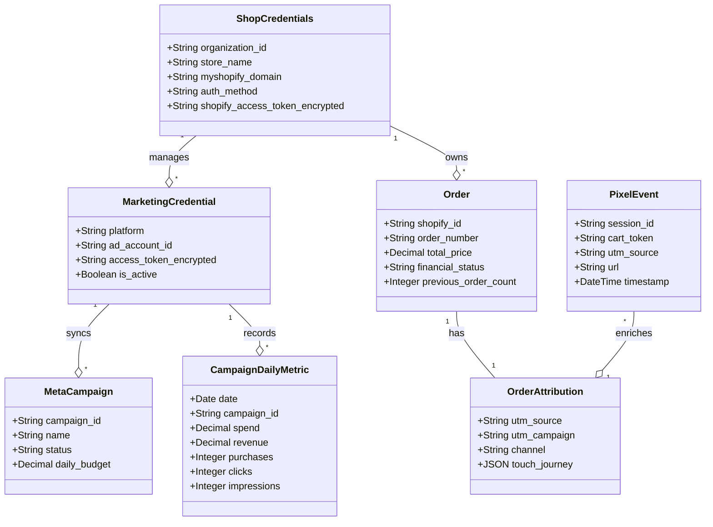

# Technical & Functional Breakdown: Marketing & Growth Module (BridgeWorks ERP/CRM)

This document provides a comprehensive breakdown of the **Marketing and Growth** module within the multi-tenant ERP/CRM unified operations platform. This module is engineered to help e-commerce brands bridgeworks storefront sales data with paid advertising spend, trace order attributions, and leverage AI-powered marketing intelligence.

---

## 1. Core Functionality & Workflows

### Primary Features
The module's functional capabilities are divided between active data sync/attribution pipelines and extensive structural stubs for future growth tools:
*   **Paid Advertising Dashboards:** Seamless sync and performance visualization for **Meta Ads** and **Google Ads** at the campaign, ad set, ad, search term, and demographic levels.
*   **First-Party Tracking (BridgeWorks Pixel):** Storefront tracking script captures customer sessions, cart tokens, UTM parameters, and ad click IDs (`fbclid`, `gclid`, etc.) to map out storefront touchpoints.
*   **Deterministic Conversion Attribution:** Maps Shopify orders to paid marketing channels (e.g., Meta Paid, Google Paid, Organic Search) by parsing Shopify landing URLs and enriching them with BridgeWorks Pixel session journeys.
*   **Marketing Aura AI Assistant:** An interactive chat copilot powered by the Gemini API that answers queries about ad performance, ROAS, and margins using live database metrics.
*   **Watchdog Anomaly Alerts:** An automated cron engine scans performance daily to trigger alerts (e.g., CPA spikes or ROAS drops) using Gemini.

### Merchant User Journey
1.  **Onboarding & Connection:** The merchant navigates to **Settings** and authorizes their Shopify store via the OAuth handshake. They also input credentials for Google Ads and Meta Ads (Developer Token, Client ID/Secret, Ad Account IDs, Access Tokens).
2.  **Campaign Launch (External):** Since BridgeWorks does *not* support ad creation or campaign management directly, the merchant launches their ad campaigns inside Meta Ads Manager or Google Ads Console, appending standard UTM tags to ad landing URLs.
3.  **Automatic Ingestion:** 
    *   **Spend Data:** Background tasks sync hourly/daily spend, click, and conversion metrics from ad network APIs.
    *   **Order Data:** Live webhooks ingestion captures Shopify orders as customers check out.
    *   **Attribution Mapping:** When an order is created, the system parses UTM codes and click IDs, matches them against connected campaign objects, and creates an `OrderAttribution` log.
4.  **Performance Auditing:** The merchant views performance on the **Overview** dashboard (checking blended ROAS, True Net Profit, CPA), drills down into ad-level creatives, reviews the **Attribution** ledger, or queries the **Marketing Aura AI** for strategic insights.

### Plugin / Webhook Architecture
*   **Shopify Integration:** Integrates dynamically via a custom OAuth installation flow (`core/views_shopify_auth.py`). Upon authorization, the platform auto-registers webhooks for orders, products, refunds, inventory, and draft orders.
*   **Ad Integrations:** Meta and Google Ads integrations are **hardcoded** into the core backend structure. There is no general plugin or middleware interface to register new channels.
*   **Extended Channels:** Integrations for YouTube Ads, Pinterest Ads, Ajio Ads, Blinkit, etc. are currently **stubbed placeholders** returning empty lists. Implementing new channels requires writing new Django models, sync tasks, and serializers.

### Feature Flags
There is **no feature flag or feature toggle system** configured in the codebase. All active endpoints are exposed globally to all tenants. Features are controlled solely by Django REST Framework role-based permission classes.

---

## 2. Data Models & Backend Architecture

### Core Django Models & Database Schema

1.  **[ShopCredentials](file:///d:/JANKI/IMP/Prototype-2/test3/backend/bridgeworks/backend/core/models/store.py#L8-L95):** Tenant anchor table containing organization metadata, billing configurations, and encrypted third-party credentials.
2.  **[MarketingCredential](file:///d:/JANKI/IMP/Prototype-2/test3/backend/bridgeworks/backend/core/models/marketing.py#L11-L62):** Stores platform credentials (access tokens, app IDs) per shop.
3.  **[CampaignDailyMetric](file:///d:/JANKI/IMP/Prototype-2/test3/backend/bridgeworks/backend/core/models/marketing.py#L109-L157):** Daily performance snapshots (spend, impressions, clicks, conversions, funnel stages) to support high-speed local queries.
4.  **[OrderAttribution](file:///d:/JANKI/IMP/Prototype-2/test3/backend/bridgeworks/backend/core/models/attribution.py#L13-L167):** One-to-one expansion table for the `Order` model containing parsed UTM parameters, click identifiers, deterministic channel classification, and multi-touch journeys.
5.  **[PixelEvent](file:///d:/JANKI/IMP/Prototype-2/test3/backend/bridgeworks/backend/core/models/pixel.py#L3-L45):** Storefront clickstream ledger tracking visits, referrer URLs, session nonces, and UTM parameters.

### Multi-Tenant Isolation
*   **Database Level:** The application shares a single logical database (PostgreSQL/SQLite) with tenant isolation enforced through foreign keys to `ShopCredentials` (which contains `organization_id`).
*   **Query Filtering:** All controllers call the helper [_get_org(request)](file:///d:/JANKI/IMP/Prototype-2/test3/backend/bridgeworks/backend/core/views_marketing.py#L85-L91) to fetch the user's active tenant and append tenant filters (e.g. `.filter(credential__shop=org)` or `.filter(org_id=org.organization_id)`) to all ORM actions.

### Encrypted Credentials Storage & Rotation
*   **Encryption at Rest:** Sensitive client credentials (Shopify tokens, Google developer tokens, Meta credentials) are symmetrically encrypted using **Fernet (AES-128 in CBC mode with HMAC-SHA256)**. The secret key is loaded from the environment (`settings.FERNET_KEY`).
*   **Rotation:** There is **no automated rotation** for integration credentials. Access tokens remain in use until overwritten by the merchant or invalidated by the third-party API.

### Role-Based Access Control (RBAC)
Endpoints in the marketing views are protected using the [IsMarketingAnalyst](file:///d:/JANKI/IMP/Prototype-2/test3/backend/bridgeworks/backend/core/permissions.py#L200-L206) permission class. Non-owner users must have the granular permission `marketing_growth:overview` (either in legacy `TeamMemberSettings` or assigned via the newer `WorkspaceMembership` Enterprise RBAC role structure) to query or trigger data operations.

### Webhook Signature Verification
Incoming Shopify webhooks are processed at [ShopifyWebhookView](file:///d:/JANKI/IMP/Prototype-2/test3/backend/bridgeworks/backend/core/views/webhooks.py#L94-L159). The system verifies signatures using `hmac.compare_digest` to match the calculated SHA256 digest of the request body against `X-Shopify-Hmac-Sha256` using three key fallbacks:
1.  The tenant's specific webhook secret (`creds.get('webhook_secret')`).
2.  The global Partner App API secret (`settings.SHOPIFY_API_SECRET`).
3.  The legacy store secret (`settings.LEGACY_SHOPIFY_WEBHOOK_SECRET`).

### GDPR & CCPA Compliance
*   **Redaction Hooks:** Mandatory Shopify GDPR endpoints (e.g., customer data requests, store/customer redaction webhooks) are **not implemented** in the webhooks routing.
*   **Consent Tracking:** There is no consent registry or opt-in/opt-out schema in the customer models.
*   **PII Security:** Customer name, phone numbers, email, and shipping addresses are stored as **plain text** directly in the `Customer` and `Order` models, with no field-level encryption.

---

## 3. Integrations & External APIs

### Shopify OAuth Handshake & Data Sync
1.  **Initiation:** `/api/shopify/install/?shop=...` constructs the auth url using `shopify.Session` containing requested scopes (`settings.SHOPIFY_SCOPES`). It sets a hex state nonce in the user session (`shopify_oauth_state`) to prevent OAuth CSRF.
2.  **Callback:** `/api/shopify/callback/` verifies parameters, checks state nonces, validates HMAC signatures, requests the permanent access token, and upgrades the tenant's `ShopCredentials.auth_method` to `'oauth'`.
3.  **Webhook Registration:** The callback automatically posts to Shopify's `/admin/api/{version}/webhooks.json` to register webhooks for orders, fulfillments, refunds, inventory levels, and products.
4.  **Historical Ingestion:** Triggered via management scripts like `sync_shopify_orders.py`, which fetches orders in pages of 250, traverses the paginated API using the HTTP `Link` header, and populates order records.

### Ad Network APIs
*   **Meta Ads API:** Uses the python `facebook-business` SDK. It pulls insights at the campaign, ad set, and ad levels along with demographics breakdown.
*   **Google Ads API:** Uses the `google-ads` client. It runs search queries on gender, age, device, search terms, and creative headlines/descriptions.

### Rate Limit Handling
*   **Meta API:** Implements a retry wrapper [execute_meta_api_with_retry](file:///d:/JANKI/IMP/Prototype-2/test3/backend/bridgeworks/backend/core/utils/marketing_retry.py#L8-L53) that detects Facebook rate limits (errors 17, 32, 613) and transient errors, retrying up to 5 times with exponential backoff and jitter.
*   **Google Ads API:** Queries are run in parallel using a Python `ThreadPoolExecutor` (max 6 workers). No explicit retry loop exists; failures logging and exceptions are handled.
*   **Shopify API:** **No API rate-limit handling** is implemented in sync commands or live webhook calls. Requests that hit Shopify's leaky bucket limit (429) will fail or crash without automatic retries.

### Webhook & Integration Error Handling
*   **Webhooks:** Webhook bodies are handled inside a standard Python thread (`threading.Thread`) to keep responses under Shopify's 5-second window. If processing throws an exception, it is logged, but no webhook retry queue or dead-letter queue is managed.
*   **Shipway PII Fetch:** The background task [fetch_missing_pii_task](file:///d:/JANKI/IMP/Prototype-2/test3/backend/bridgeworks/backend/core/tasks/shipway_sync.py#L61-L228) (which retrieves unredacted customer info from Shipway to bypass Shopify's PII redaction) uses `django-q` schedule retries with exponential backoff (retrying up to 5 times) if the API returns transient errors.

### Throttling & Abuse Prevention
DRF throttling classes (`AnonRateThrottle`, `UserRateThrottle`, `ScopedRateThrottle`) are registered in `settings.py`. Critical authentication views have explicit throttling decorators, but customer-facing marketing endpoints (like referral links, sharing mechanisms) do not exist and therefore require no endpoint-specific throttling.

---

## 4. Analytics & Reporting

### Tracked Metrics & Calculations
*   **Marketing Overview Metrics:** Ad Spend, Impressions, Clicks, CPC, CPM, CTR, Conversions, CPA, and AOV.
*   **Blended ROAS / MER:** Calculates blended return on ad spend:
    $$\text{Blended ROAS} = \frac{\text{Total Shopify Revenue}}{\text{Total Ad Spend}}$$
    $$\text{Blended ROAS (After Tax)} = \frac{\text{Total Shopify Revenue}}{\text{Total Ad Spend} \times (1 + \frac{\text{GST Rate}}{100})}$$
*   **True Net Profit:** Incorporates operational costs to determine true margins:
    $$\text{True Net Profit} = \text{Revenue} - \text{Ad Spend} - (\text{Revenue} \times \text{COGS \%}) - (\text{Shipping Cost Per Order} \times \text{Total Orders})$$
*   **Customer Retention Breakdown:** Aggregates order count based on `previous_order_count` (New customers have `0`, Returning have `> 0`).

### Serving Data & Performance
*   **Real-time DB Aggregations:** Retention breakdowns and Shopify order values are computed on-the-fly via Django ORM aggregations (`Sum`, `Count`, `Avg`) directly from the `Order` table. Customer segments are not pre-calculated or stored in a cache.
*   **Pre-Aggregated Snapshots:** Paid ad network spend, clicks, and conversion data are pre-synced to metric tables (`CampaignDailyMetric`, etc.) by cron jobs to prevent API roundtrips during dashboard hits.
*   **N+1 Query Resolutions:** The attribution sheet queries use `select_related('attribution')` and `select_related('order')` to pull associated details in a single query.
*   **Background Jobs:** Managed using **Django Q (django-q2)**. Sync routines (`fetch_meta_daily_metrics`, `fetch_google_ads_daily_metrics`) and the historical backfill task run as background workers to prevent web server timeouts.

---

## 5. Frontend Components & UI

The frontend layout is located in `frontend/src/components/marketing` and `frontend/src/pages/MarketingPage.jsx`.

*   **MarketingOverview.jsx:** Displays the main metric grid cards (Spend, Revenue, Blended ROAS, AOV, CPA) with tax-adjustment switches, profit charts, and platform performance summaries.
*   **MarketingSidebar.jsx:** Provides left-pane navigation grouped by channels, highlighting the active "Paid Advertising" items and visually graying out stub modules with a "Soon" badge.
*   **MetaCampaigns.jsx / GoogleAdsPerformance.jsx:** Displays campaign, ad set, and ad metrics in table layouts, calculating ROAS, CPC, CTR, and showing ad headlines/creative variants.
*   **DemographicBreakdowns.jsx:** Plots age, gender, and device distribution metrics using bar and pie charts.
*   **Attribution.jsx:** Displays the multi-touch attribution reports, conversion paths, and order spreadsheets.
*   **MarketingIntelligence.jsx:** Embedded Gemini AI chat window ("Marketing Aura") displaying chat histories and streaming responses.

---

## 6. Limitations & Technical Debt

1.  **Placeholder Views:** A large portion of the visual navigation consists of placeholder stubs (`AjioAds.jsx`, `AmazonAds.jsx`, `SocialCalendar.jsx`, etc.) that return dummy components and hardcoded stub responses.
2.  **No Automated API Key Rotation:** API secrets and OAuth tokens for Shopify, Meta, and Google Ads do not rotate, posing a security risk if a database is compromised.
3.  **Missing Cache Layer for Cohort Analytics:** Analytics like New vs Returning Customer revenue are calculated using live database queries. For high-volume e-commerce brands (hundreds of thousands of orders), running these live queries will lead to database performance issues.
4.  **No Shopify API Rate Limit Resilience:** The Shopify order sync script lacks `429` error detection and retry queues.
5.  **GDPR Mandates Missing:** Mandatory GDPR webhook handling is missing, which could cause compliance issues when listing on the Shopify App Store.
6.  **No Test Coverage:** The suite contains tests for workforce, todo visibility, and control tower engines, but **no tests** exist for paid marketing syncs, attribution logic, or profitability calculations.
7.  **Plain Text PII Storage:** Customer phone numbers, addresses, and email addresses are stored in plain text, making the platform susceptible to database exposure issues.
8.  **Hardcoded Integrations:** The platform lacks a flexible adapter or driver pattern for paid ad platforms, requiring code modifications to add any new integration.
